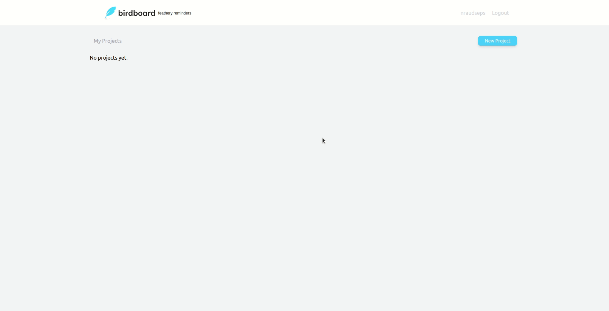

# Birdboard

A Basecamp like application where users can create personal projects and add tasks.
This program is based on the Laracasts.com series ['Build A Laravel App With TDD'](https://laracasts.com/series/build-a-laravel-app-with-tdd).

##### Built with:
- Laravel
- TailwindCSS

## Getting Started

### Prerequisites

1. PHP 7.4 or above
2. Composer 1.10 or above
3. npm v12 or above

### Installation and Setup
1. Clone this repository from Github - `git clone https://github.com/NRaudseps/birdboard.git`.
2. Create a database named birdboard on MySQL or any DMS that you prefer.
3. Install your composer dependencies on the application: `composer install`.
4. Install all the necessary npm dependencies and files: `npm install && npm run dev`
5. Copy the `.env.example` file and rename it `.env`.
6. Set up your .env file.
7. Run `php artisan migrate` to migrate tables to your database.

### Acknowledgments
- Laracasts.com - ['Build A Laravel App With TDD'](https://laracasts.com/series/build-a-laravel-app-with-tdd).
